# Latihan-VCS
Tugas Pertemuan Ke 4 Bahasa Pemrograman

Nama    : Faza Ardan Kusuma

NIM     : 312010001

Kelas   : T1.B1.20

Prodi   : Teknik Informatika

# Tutorial Penggunaan Git

1. Download Git
   
    Langkah pertama adalah download aplikasi Git di web resminya [Git download](https://git-scm.com/) dan pilihlah aplikasi Git sesuai dengan OS yang kamu gunakan sekarang (windows / linux)
    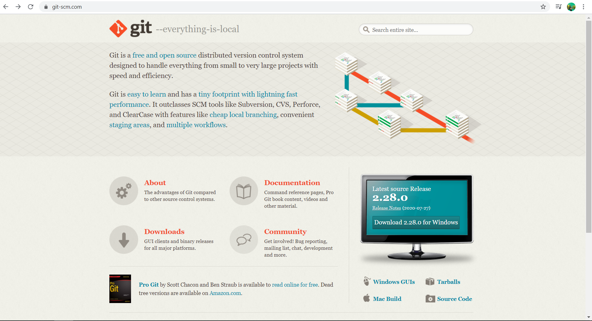

2. Install Git

    * Klik kanan pada installer Git yang sudah di download, lalu klik *Next*
    >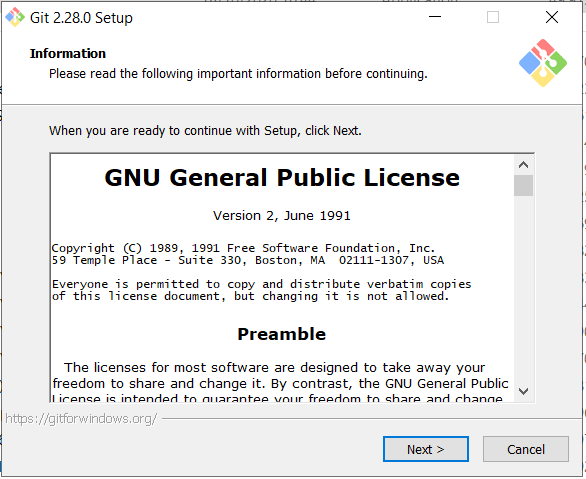

    * Selanjutnya tentukan folder instalasi, biasanya sesuai default, bila ingin folder yang lain tinggal diganti, lalu klik *Next*
    >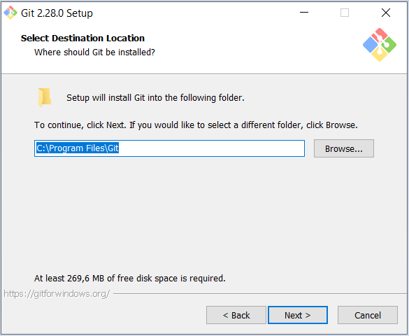

    * Selanjutnya pilih komponen yang akan di install, lalu klik *Next*
    >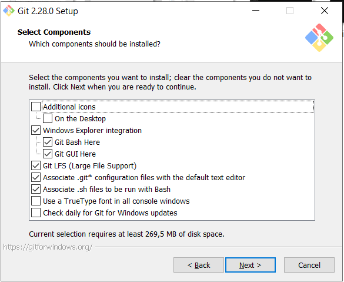

    * Selanjutnya pilih direktori start menu, lalu klik *Next*
    >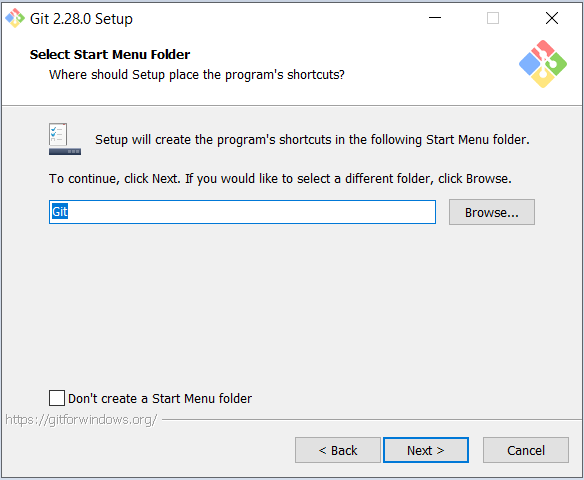

    * Selanjutnya pilih default editor yang akan digunakan, bisa menggunakam *Visual Basic Studio, Vim, Sublime Text*, dll. Sesuaikan dengan yang akan digunakan, lalu klik *Next*
    >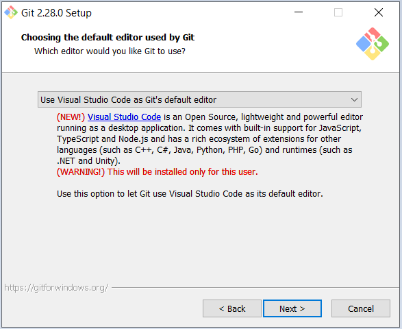

    * Selanjutnya pilih yang tengah agar perintah git dapat dikenali *Command Prompt* (CMD), lalu klik *Next*
    >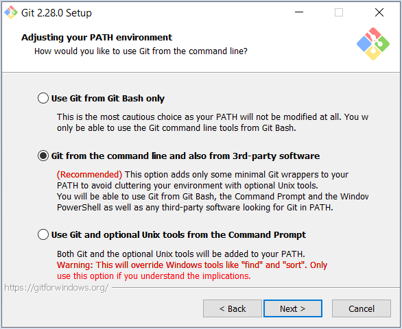

    * Selanjutnya pilih *Use the OpenSSL library*, lalu klik *Next*
    >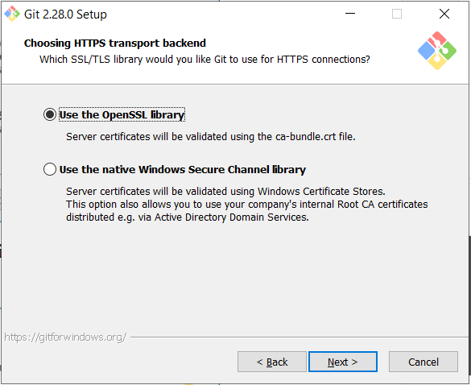

    * Selanjutnya pada pilihan line ending pilih windows style, lalu klik *Next*
    >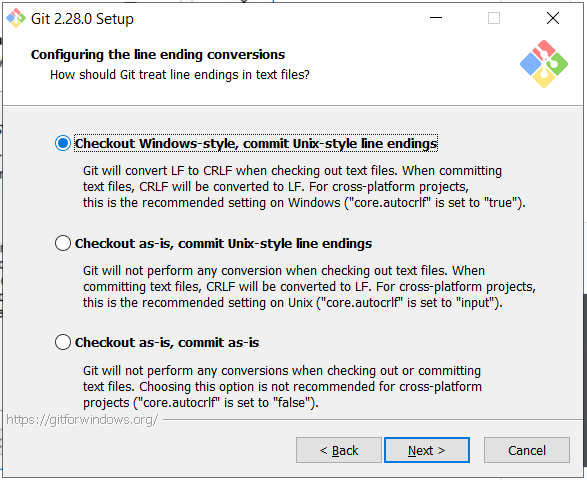

    * Selanjutnya pilih terminal emulator windows, lalu klik *Next*
    >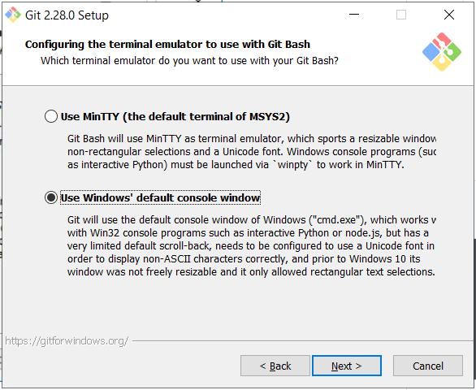

    * Selanjutnya pilih *default*, lalu klik *Next*
    >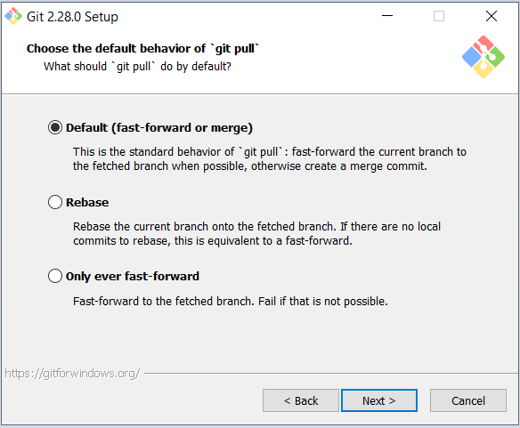

    * Selanjutnya pilih *Git Credential for Windows*, yang tengah lalu klik *Next*
    >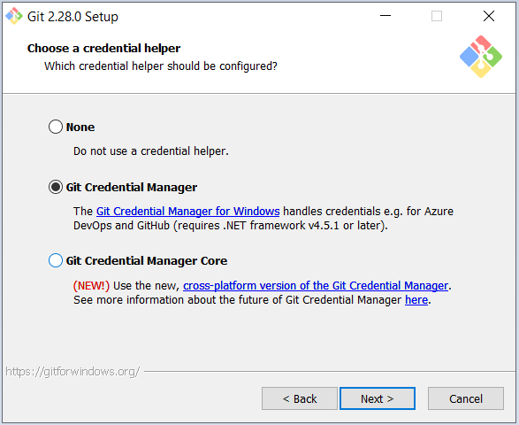

    * Selanjutnya pada extra option bisa dipilih atau juga tidak sesuai kebutuhan, lalu klik *Next*
    >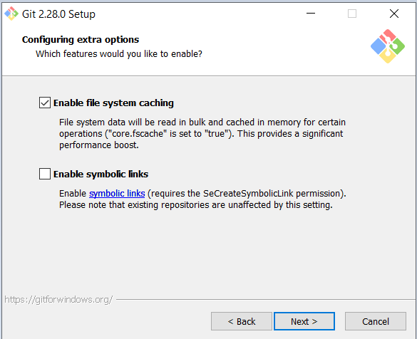

    * Selanjutnya bila ingin support untuk pseudo console bisa di pilih, bila tidak lewati saja, klik *Next*
    >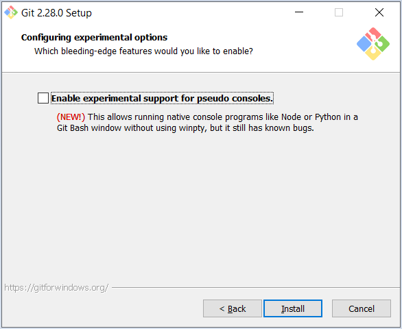

    * Selesai untuk instalasi git
    >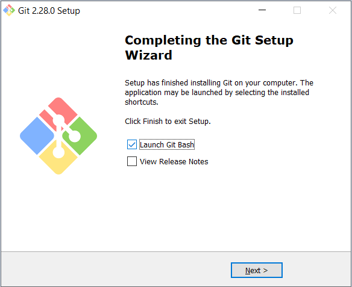

3. Menggunakan Git 

    * Buka software **GitBash** yang telah diinstall. Lakukan pengecekan versi gitbash dengan mengetik syntax berikut :
    > git --version

    > 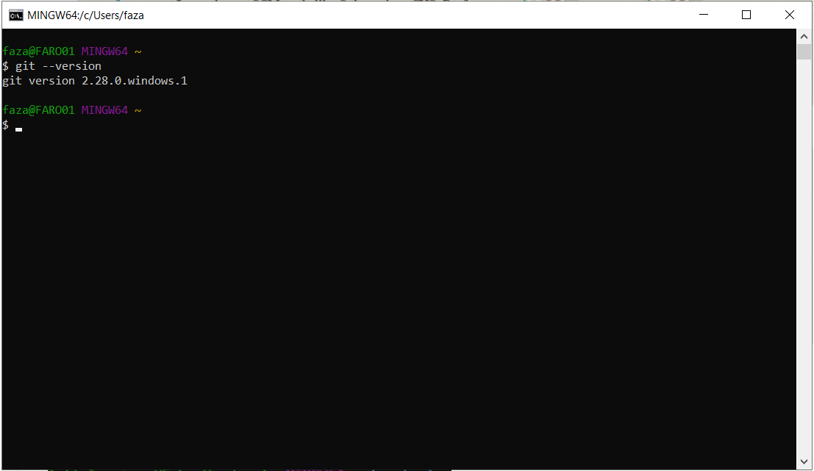

    Bila muncul versi Git berarti Git sudah berhasail di install dan siap untuk digunakan.

    * Pada saat pertama kali menggunakan Git diperlukan konfigurasi username dan email dahulu dengan cara mengetik syntax berikut :
    > git config --global user.name "Masukkan nama"

    > git config --global user.email "Masukkan email"

    > 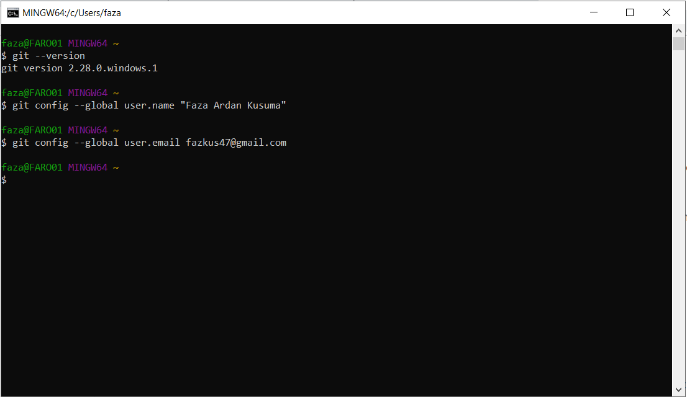

    * Setelah diisi, lakukan pengecekan username dan email dengan memasukkan syntax berikut :
    > git config --global user.name

    > git config --global user.email

    >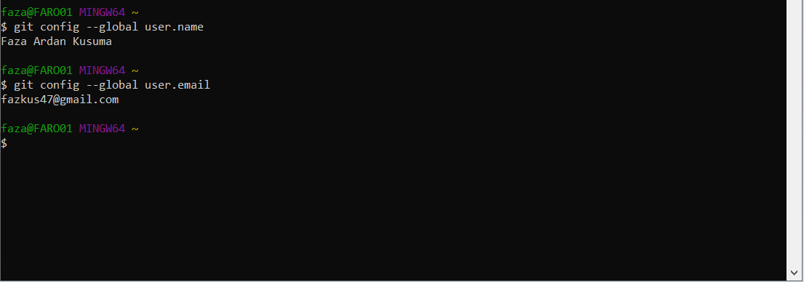

4. Membuat Repository 

    * Buka akun [GitHub](https://github.com/). Buatlah akun GitHub dan lakukan *verivikasi email* agar akun GitHub bisa digunakan, bila sudah ada tinggal *Sign in*.
    
    

    * Jika sudah terverifikasi akun GitHubnya atau sudah login, untuk membuat Repository atau juga bisa disebut Repo, Klik tanda +, lalu pilih *New Repostory*

    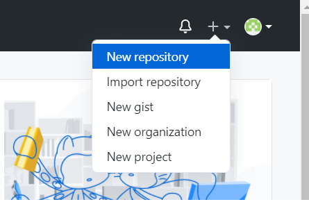

    * 

