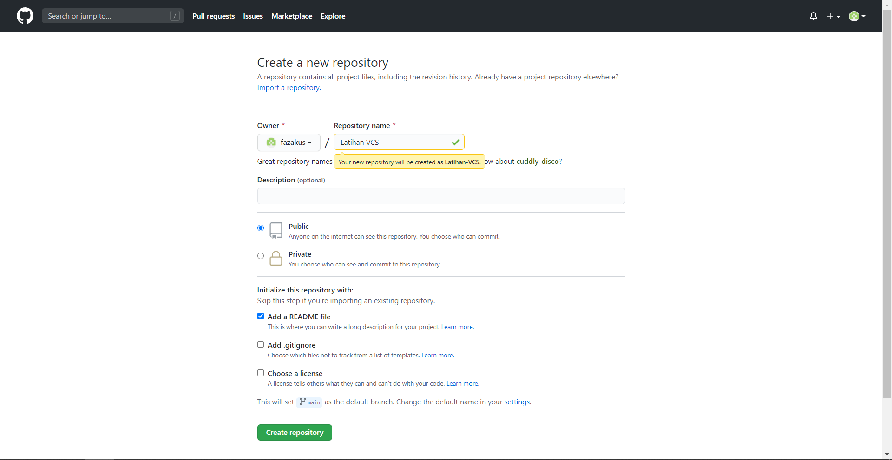
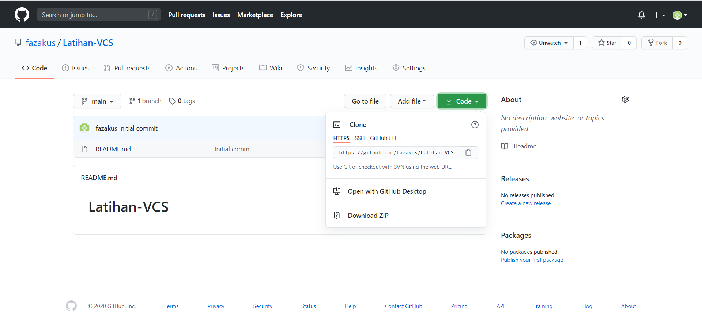
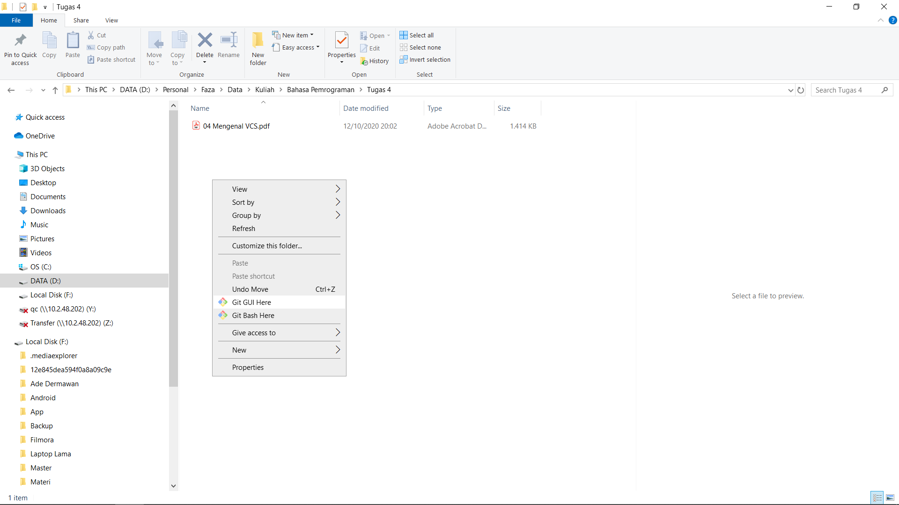
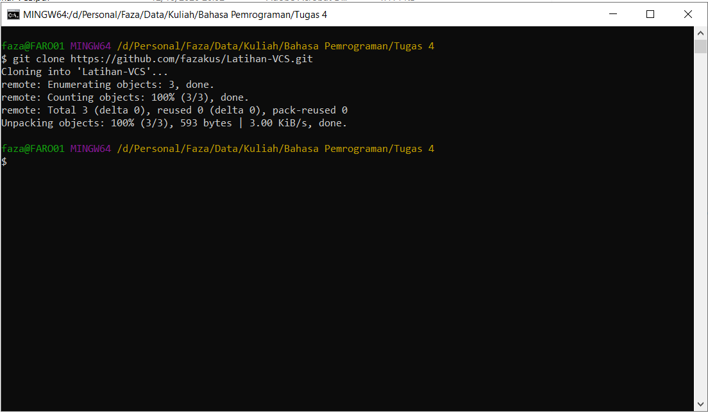
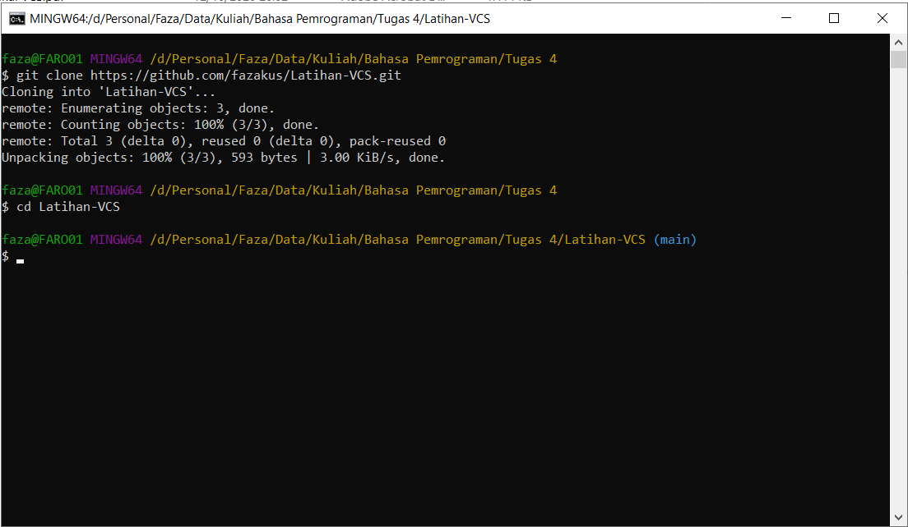
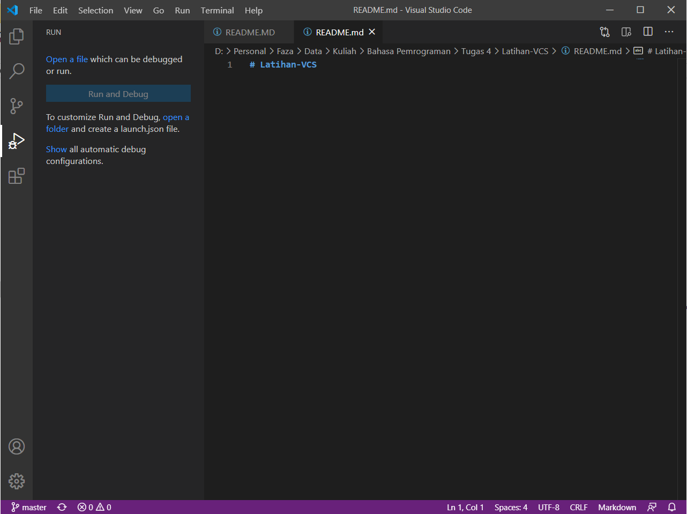
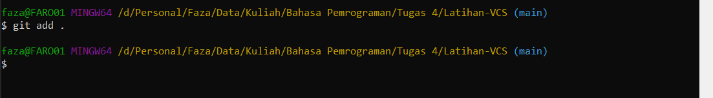

# Latihan-VCS
Tugas Pertemuan Ke 4 Bahasa Pemrograman

Nama    : Faza Ardan Kusuma

NIM     : 312010001

Kelas   : T1.B1.20

Prodi   : Teknik Informatika

# Tutorial Penggunaan Git

1. Download Git
   
    Langkah pertama adalah download aplikasi Git di web resminya [Git download](https://git-scm.com/) dan pilihlah aplikasi Git sesuai dengan OS yang kamu gunakan sekarang (windows / linux)
    

2. Install Git

    * Klik kanan pada installer Git yang sudah di download, lalu klik *Next*
    >

    * Selanjutnya tentukan folder instalasi, biasanya sesuai default, bila ingin folder yang lain tinggal diganti, lalu klik *Next*
    >

    * Selanjutnya pilih komponen yang akan di install, lalu klik *Next*
    >

    * Selanjutnya pilih direktori start menu, lalu klik *Next*
    >

    * Selanjutnya pilih default editor yang akan digunakan, bisa menggunakam *Visual Basic Studio, Vim, Sublime Text*, dll. Sesuaikan dengan yang akan digunakan, lalu klik *Next*
    >

    * Selanjutnya pilih yang tengah agar perintah git dapat dikenali *Command Prompt* (CMD), lalu klik *Next*
    >

    * Selanjutnya pilih *Use the OpenSSL library*, lalu klik *Next*
    >

    * Selanjutnya pada pilihan line ending pilih windows style, lalu klik *Next*
    >

    * Selanjutnya pilih terminal emulator windows, lalu klik *Next*
    >

    * Selanjutnya pilih *default*, lalu klik *Next*
    >

    * Selanjutnya pilih *Git Credential for Windows*, yang tengah lalu klik *Next*
    >

    * Selanjutnya pada extra option bisa dipilih atau juga tidak sesuai kebutuhan, lalu klik *Next*
    >

    * Selanjutnya bila ingin support untuk pseudo console bisa di pilih, bila tidak lewati saja, klik *Next*
    >

    * Selesai untuk instalasi git
    >

3. Menggunakan Git 

    * Buka software **GitBash** yang telah diinstall. Lakukan pengecekan versi gitbash dengan mengetik syntax berikut :
    > git --version

    > 

    Bila muncul versi Git berarti Git sudah berhasail di install dan siap untuk digunakan.

    * Pada saat pertama kali menggunakan Git diperlukan konfigurasi username dan email dahulu dengan cara mengetik syntax berikut :
    > git config --global user.name "Masukkan nama"

    > git config --global user.email "Masukkan email"

    > 

    * Setelah diisi, lakukan pengecekan username dan email dengan memasukkan syntax berikut :
    > git config --global user.name

    > git config --global user.email

    >

4. Membuat Repository 

    * Buka akun [GitHub](https://github.com/). Buatlah akun GitHub dan lakukan *verivikasi email* agar akun GitHub bisa digunakan, bila sudah ada tinggal *Sign in*.
    >

    * Jika sudah terverifikasi akun GitHubnya atau sudah login, untuk membuat Repository atau juga bisa disebut Repo, Klik tanda +, lalu pilih *New Repostory*
    >

    * Lalu akan muncul halaman *Create New Repository* lalu buatlah Repository sesuai keinginan anda. Misalkan saya akan membuat repository Latihan VCS seperti di gambar.
    >

    > Repository Name : Nama repository yang diinginkan

    > Description : Isi dengan deskripsi atau penjelasan tentang repository anda

    > Public / Private : PIlihan untuk repository yang akan dibuat bisa dilihan oleh semua orang (Public) atau hanya bisa dilhat sendiri(Private)

    > Add a README.md file : Membuat file README.md ada di repository Anda

    > Add .gitignore : Merupakan sebuah file yang berisi daftar nama-nama file dan direktori yang akan diabaikan oleh Git

    > Choose a license : Silahkan centang jika Anda memiliki lisensi pada repository yang akan dibuat Kemudian tekan tombol Create Repository untuk menyimpan

    * Setelah Repository dibuat maka akan muncul tampilan halaman repository anda seperti di bawah ini
    >[GitHub New File](Pic/githubnewfile.png)

    * Untuk mengkoneksikan Repository GitBash lokal dengan GitHub atau juga bisa disebut meremote GitHub pada GitBash lokal. Lakukan clone pada Github ke Gitbash dengan cara :
    > Klik Code, lalu Copy *Link URL* 
    

    * Buat dan pilih folder dimana kita akan *men-Clone* atau mendownload Repository dari GitHub ke direktori lokal. Lalu klik kanan di dalam folder yang sudah di tentukan, dan *pilih* ***Git Bash here***
    

    * Akan muncul *Command Prompt* (CMD) Git Bash, lalu ketikkan syntax berikut :
    > git clone [URL Repository pada github]
    > Contoh : git clone https://github.com/fazakus/Latihan-VCS.git
    >

    * Setelah selesai Cloning, pindah ke folder Cloning yang telah dibuat, contoh Latihan-VCS, dengan syntax berikut :
    > cd Latihan-VCS
    > Untuk penulisan spasi pada *Command Prompt* (CMD) tidak bisa menggunakan spasi, melainkan menggunakan "-" sebagai pengganti spasi, tapi untuk di tampilan atau outputnya nanti tetap spasi
    >

    * Setelah masuk ke dalam folder *Latihan-VCS*, silahkan edit file **README.md** yang ada pada File Explorer menggunakan *Text Editor* seperti *Vim, Sublime Text, Notepad ++, Visual Studio Code*, dan yang lainnya. Disini saya menggunakan *Visual Studio Code* sebagai *Text Editor*
    >

    > Setelah selesai editing, simpan file dengan cara **CTRL + S** atau bisa juga klik **File**, lalu **Save**

    * Setelah save file README.md, kembali ke aplikasi **GitBash**. Ketik syntax berikut :
    > git add .
    >

    > 